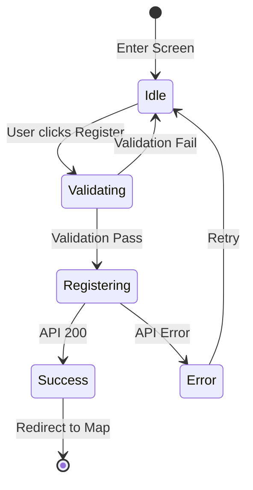

# Data Model: User Registration

**Feature**: User Registration (`013-auth-register`)

## Entities

### User (Auth)
Represents the user in the identity provider (Supabase).

| Field | Type | Validation |
|-------|------|------------|
| id | UUID | Primary Key |
| email | String | Valid email format, unique |
| password | String | Min 8 characters |
| full_name | String | Non-empty, max 100 chars |

## State Transitions

